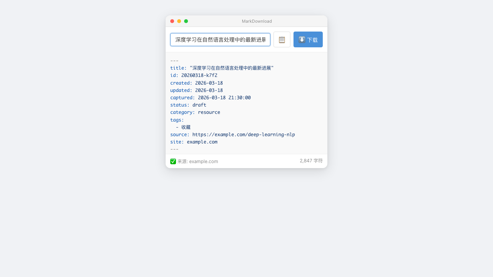

<div align="center">

# MarkDownload Chinese Edition

**One-click web clipping to Markdown, built for Obsidian users**

[](LICENSE)
[](https://developer.chrome.com/docs/extensions/mv3/)
[](https://www.typescriptlang.org/)
[](https://wxt.dev/)

English | [简体中文](README.md)



</div>

---

## Why MarkDownload Chinese Edition?

| | Other Clippers | MarkDownload |
|:---:|:---:|:---:|
| **Permissions** | All sites / broad host access | `activeTab` only — access on click |
| **Chinese Sites** | Broken images, ads, encoding issues | 68 sites deeply adapted |
| **Obsidian** | Manual frontmatter | Auto-generated frontmatter |
| **Privacy** | May upload data | Fully local, zero network requests |

## Features

- **One-Click Clip** — Click the icon to extract, convert, and download as Markdown
- **68 Site Adapters** — WeChat, Zhihu, CSDN, Juejin, QQ News, Reddit, and more
- **Obsidian Frontmatter** — Auto-generates `title` / `id` / `created` / `tags` / `source`
- **Smart Image Handling** — 13 lazy-load attributes detected, relative URLs auto-resolved
- **Live Preview** — Preview full Markdown before downloading, edit title inline
- **Privacy First** — Only `activeTab` + `scripting` + `downloads` permissions

## Quick Start

### Install (Dev Build)

```bash
git clone https://github.com/yuevthins/markdownload-zh.git
cd markdownload-zh/markdownload-zh
npm install
npm run build
```

Then in Chrome:
1. Open `chrome://extensions/`
2. Enable "Developer mode"
3. Click "Load unpacked"
4. Select the `.output/chrome-mv3/` directory

### Usage

1. Open any web page
2. Click the extension icon
3. Preview Markdown / edit title
4. Click **Download** or **Copy**

## Output Format

Generated Markdown files include Obsidian-compatible frontmatter:

```yaml
---
title: "Article Title"
id: 20260318-k7f2
created: 2026-03-18
updated: 2026-03-18
captured: 2026-03-18 21:30:00
status: draft
category: resource
tags:
  - saved
source: https://example.com/article
site: example.com
---
```

## Supported Sites

<details>
<summary><b>View all 68 adapted sites</b></summary>

| Category | Sites |
|:---------|:------|
| **Chinese Communities** | WeChat Official Accounts, Zhihu, CSDN, Juejin, cnblogs, SegmentFault, Jianshu, sspai |
| **News** | QQ News, The Paper, iFeng, NetEase News, Baidu Baike |
| **Tech Blogs** | Medium, Dev.to, Hacker News, InfoQ |
| **Doc Frameworks** | GitBook, Docusaurus, VuePress, MkDocs, Read the Docs |
| **Social** | Reddit (including Shadow DOM), TikTok Shop |
| **Others** | Chinese Wikipedia, and more... |

</details>

## Architecture

```
4-Stage Pipeline Architecture (Pipeline + Site Adapter)

User clicks icon → Popup
       ↓
chrome.scripting.executeScript
       ↓
┌──────────────────────────────────────┐
│  Stage 1: Preprocess                 │
│  Lazy images · Table normalization   │
├──────────────────────────────────────┤
│  Stage 2: Extract                    │
│  Readability.js + fallback extractor │
├──────────────────────────────────────┤
│  Stage 3: Convert                    │
│  Turndown HTML→Markdown + GFM        │
├──────────────────────────────────────┤
│  Stage 4: Format                     │
│  Zero-width char cleanup · Newlines  │
└──────────────────────────────────────┘
       ↓
Popup renders preview → Download / Copy
```

## Development

```bash
cd markdownload-zh

npm run dev              # Dev mode (hot reload)
npm test                 # Unit tests (Vitest)
npm run test:integration # Integration tests
npm run test:e2e         # E2E tests (Playwright)
npm run lint             # ESLint
npm run build            # Production build
```

### Adding a New Site Adapter

1. Create an adapter file in `lib/sites/adapters/`
2. Implement the `SiteAdapter` interface (or use `createSimpleAdapter()`)
3. Register it in `lib/sites/index.ts`
4. Add test fixtures

## Tech Stack

| Technology | Purpose |
|:-----------|:--------|
| [WXT](https://wxt.dev/) | Browser extension framework |
| [TypeScript](https://www.typescriptlang.org/) | Type safety |
| [Readability.js](https://github.com/mozilla/readability) | Content extraction (Mozilla) |
| [Turndown](https://github.com/mixmark-io/turndown) | HTML → Markdown conversion |
| [Vitest](https://vitest.dev/) | Unit testing |
| [Playwright](https://playwright.dev/) | E2E testing |

## License

[MIT](LICENSE)

---

<div align="center">

**If you find this useful, please give it a Star ⭐**

</div>
